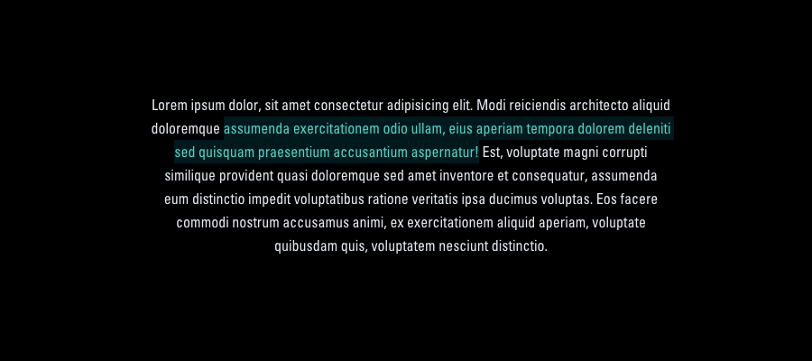

# Variant ::selection for Tailwind CSS

## Instalation

```bash
npm install tailwindcss-selection
```

## Usage

```js
// tailwind.config.js
module.exports = {
  variants: {
    backgroundColor: ['responsive', 'dark', 'group-hover', 'focus-within', 'hover', 'focus', 'selection'],
    textColor: ['responsive', 'dark', 'group-hover', 'focus-within', 'hover', 'focus', 'selection'],
  },
  plugins: [
    require('tailwindcss-selection'),
  ],
};
```

Then use as you would use other variants.

```html
<div class="bg-black selection:bg-teal-900 selection:text-teal-400">
    Lorem ipsum dolor, sit amet consectetur adipisicing elit. Modi reiciendis architecto aliquid doloremque assumenda exercitationem odio ullam, eius aperiam tempora dolorem deleniti sed quisquam praesentium accusantium aspernatur! Est, voluptate magni corrupti similique provident quasi doloremque sed amet inventore et consequatur, assumenda eum distinctio impedit voluptatibus ratione veritatis ipsa ducimus voluptas. Eos facere commodi nostrum accusamus animi, ex exercitationem aliquid aperiam, voluptate quibusdam quis, voluptatem nesciunt distinctio.
<div>
```


